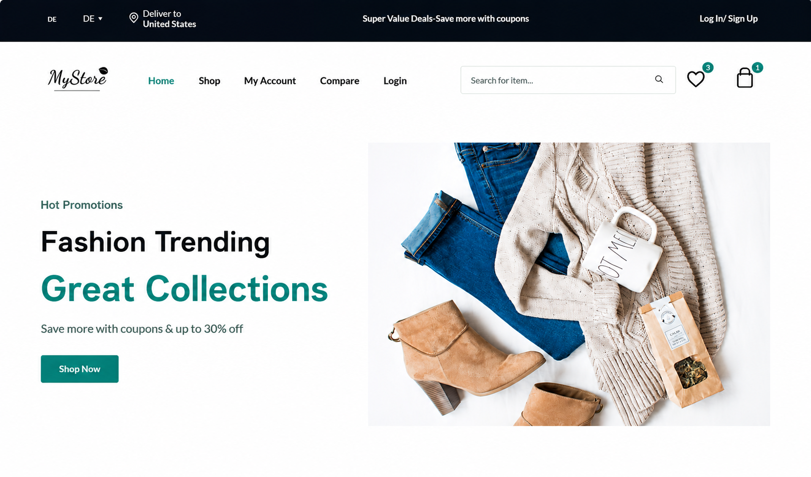

# 🛍️ MyStore — Responsive E-Commerce Website

A fully responsive front-end e-commerce website built from scratch using **HTML, CSS, and vanilla JavaScript** — featuring a working shopping cart, wishlist, live search, multi-country currency conversion, and more. Built as my first web development project.


---

## 🔗 Live Demo

> Add your live link here after enabling GitHub Pages (see setup steps below):
>
> https://shehla-codex.github.io/Mystore-ecommerce-website/
---
## Screenshots

### Home Page


### Shop Page


### Mobile Responsive
.png)

### Mobile Responsive
.png)

## ✨ Features
### 🛒 Shopping Experience
- Add to Cart with live quantity updates and subtotal calculation
- Wishlist (add/remove products, persists across sessions)
- Live product search — instantly filters products by name
- Product comparison page
- Product detail page with image gallery, tabs (info/reviews), and related products

### 🌍 Localization
- **Deliver to Country** selector with 15 countries (Pakistan, USA, UK, UAE, Saudi Arabia, India, and more)
- Automatic **currency conversion** based on selected country (USD, PKR, GBP, EUR, AED, INR, etc.)
- Language selector with 15 languages (UI-level)

### 🎨 Design & UX
- Fully responsive across desktop, tablet, and mobile (custom breakpoints)
- Amazon-inspired dark header with dropdown navigation
- Mobile-friendly slide-out hamburger menu
- Product image sliders (Categories & New Arrivals) powered by Swiper.js
- Auto-repeating countdown timer for "Deal of the Day"
- Tabbed product sections (Featured / Popular / New Added)
- Toast notifications for cart & wishlist actions

### 📄 Pages Included
| Page | Description |
|---|---|
| `index.html` | Homepage with hero banner, categories, deals, new arrivals |
| `shop.html` | Full product listing with search & pagination |
| `details.html` | Single product detail page |
| `cart.html` | Shopping cart with live totals |
| `wishlist.html` | Saved/wishlisted products |
| `compare.html` | Side-by-side product comparison |
| `checkout.html` | Billing details & order summary |
| `login-register.html` | Login & registration forms |
| `accounts.html` | User account dashboard |

---

## 🛠️ Tech Stack

- **HTML5** — Semantic markup
- **CSS3** — Custom properties (variables), Flexbox, Grid, responsive media queries
- **JavaScript (Vanilla ES6+)** — Cart/wishlist logic, currency conversion, search, DOM manipulation, `localStorage` for data persistence
- **[Swiper.js](https://swiperjs.com/)** — Touch sliders for categories & new arrivals
- **[Flaticon UIcons](https://www.flaticon.com/uicons)** — Icon set

---

## 📂 Folder Structure

```
mystore-ecommerce/
├── index.html
├── shop.html
├── details.html
├── cart.html
├── wishlist.html
├── compare.html
├── checkout.html
├── login-register.html
├── accounts.html
├── style.css
├── script.js
├── /images          → all product & UI images
└── README.md
```

---

## 🚀 Getting Started (Run Locally)

1. **Clone the repository**
   ```bash
  git clone https://github.com/shehla-codex/Mystore-ecommerce-website.git
   ```
2. **Open the project folder**
   ```bash
  cd Mystore-ecommerce-website
   ```
3. **Open `index.html` in your browser**
   - Easiest way: install the [Live Server](https://marketplace.visualstudio.com/items?itemName=ritwickdey.LiveServer) extension in VS Code, right-click `index.html` → **Open with Live Server**.
   - Or simply double-click `index.html` to open it directly in your browser.

No build tools, no npm install, no backend needed — it's a pure front-end project. 🎉

---

## 🎯 Key Learnings from This Project

- Structuring a multi-page website with consistent, reusable components
- Writing responsive CSS with custom properties and multiple breakpoints
- Working with `localStorage` to persist cart/wishlist data across pages
- Building interactive UI elements (dropdowns, tabs, sliders, countdown timers) with vanilla JavaScript
- Handling real-world UX details like currency formatting and search filtering

---

## 🔮 Future Improvements

- [ ] Connect to a real backend (Node.js/Express + database) for real checkout and user accounts
- [ ] Add real payment gateway integration
- [ ] Full multi-language translation (not just UI labels)
- [ ] User authentication (sign up/login with real validation)
- [ ] Product filtering by price, category, and rating on the shop page

---

## 👩‍💻 Author

**Syeda Shehla**

Feel free to connect or reach out with feedback!

---

## 📄 License

This project is open source and available under the [MIT License](LICENSE).
